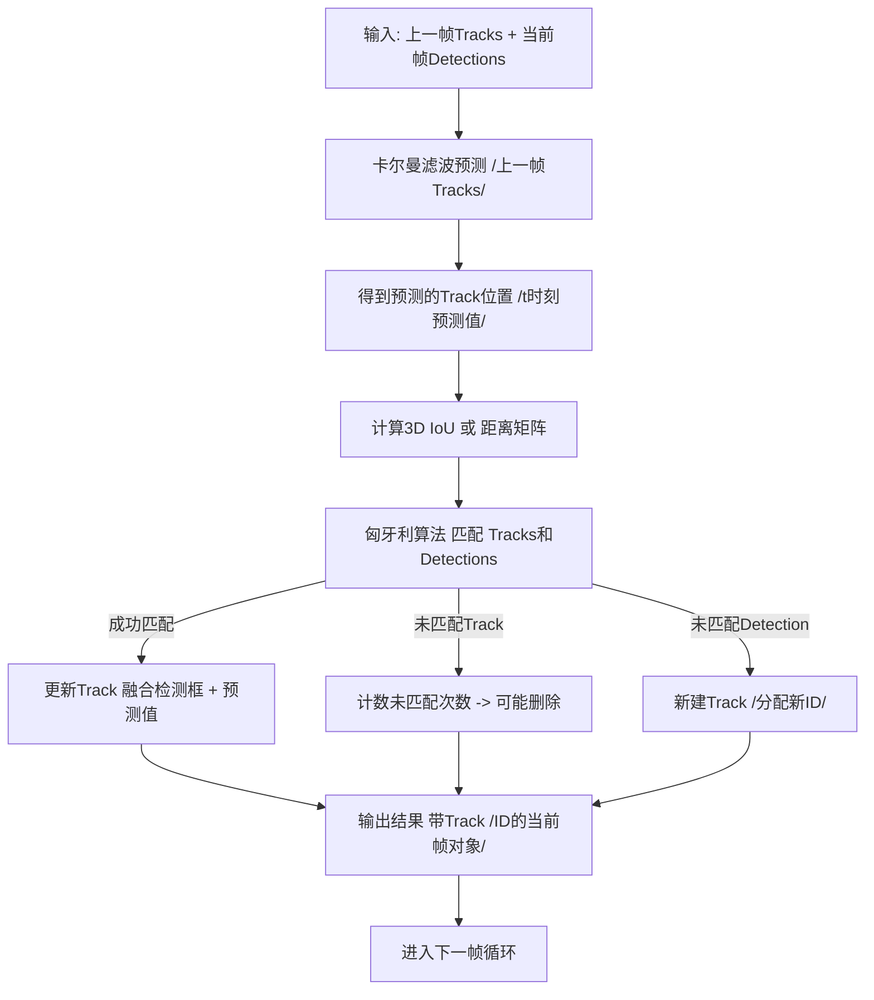
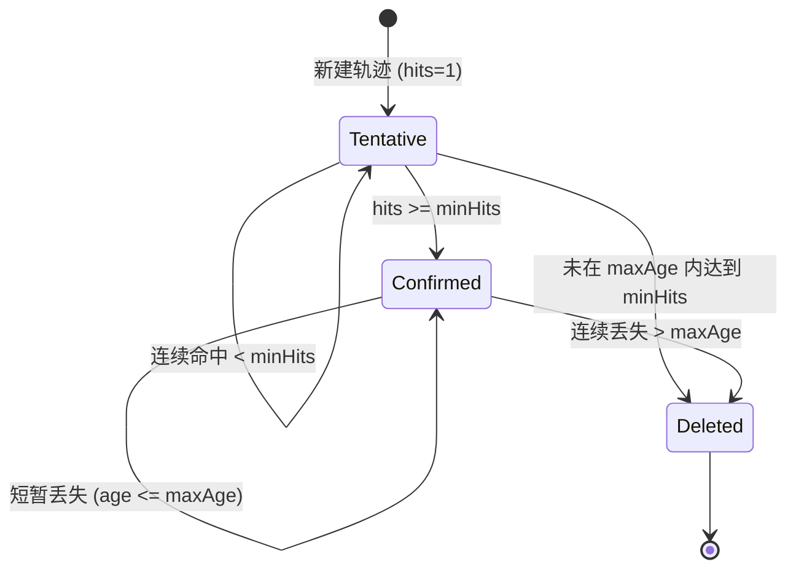
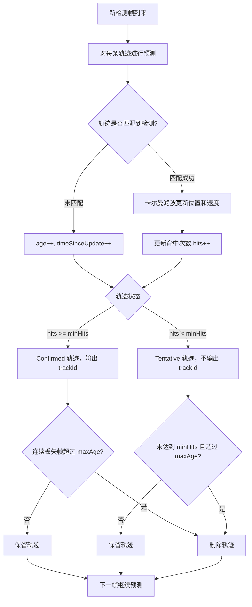
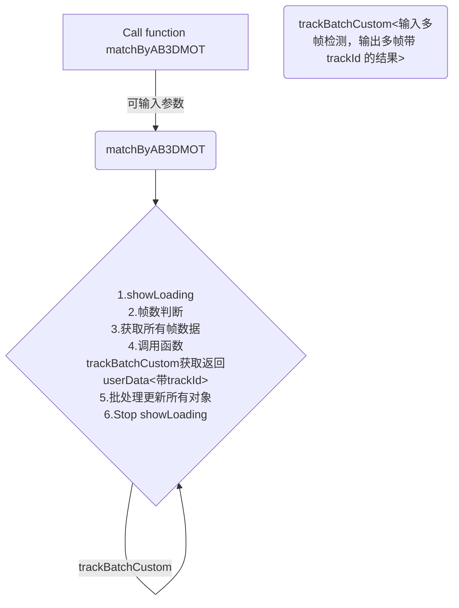

# 4DAPF-AB3DMOT<JS/TS>

> AB3DMOT 的JS/TS实现。 ——2025.09.22

> 在标准数据集里测试过。

## 一.流程

> 1. 提取全部已有标注结果

> 2. 将结果输入算法->输出结果

> 3. 用输出的结果更新全部objects的trackId

1.  输入一帧数据
    
    是按帧预测的，起码有两帧才能开始预测。
    
    输入一帧数据表示输入这一帧的全部标注结果。
    
2.  卡尔曼滤波预测
    
    对上一帧的已追踪对象，用3D卡尔曼滤波器进行状态预测，得到在当前帧的预测结果<位置，尺寸，朝向角等>
    
3.  计算相似度
    

这一步是对比 **上一帧的检测框在当前帧的预测框** 与 **当前帧的检测框**

1.  \[简单\] 中心距离相似度
    
2.  \[复杂\] 3DIoU计算相似度（代价矩阵）
    

1.  最优匹配
    
    1.  根据代价矩阵，用匈牙利算法找最优匹配
        
        1.  匹配成功：更新卡尔曼滤波器
            
        2.  匹配失败的检测：新建Track
            
        3.  匹配失败的Track：计数未匹配次数，超出阈值删除
            
2.  输出带TrackID的结果
    

### 流程图

单个目标轨迹（Track）如何在其生命周期内进行状态转换的逻辑

单个轨迹生命周期

## 二.详细解释

### 第四步  “匹配成功 → 更新卡尔曼滤波器” 

---

#### 背景

*   **上一帧的Track**：每个目标都有一个卡尔曼滤波器对象，里面保存了状态 `x`（位置、速度、可能加上加速度）和协方差矩阵 `P`（表示不确定性）。
    
*   **当前帧检测**：得到了新的检测框（位置、大小、朝向）。
    
*   **匹配结果**：通过匈牙利算法，把上一帧预测的Track与当前帧检测匹配起来了。
    

---

#### 匹配成功的意义

假设 Track A 匹配到了 Detection B，这表示卡尔曼预测的位置和真实检测比较接近，可以认为是同一个物体。

那么就要**用 Detection B 的观测来更新 Track A 的状态**，让卡尔曼滤波器纠正预测偏差。

---

#### 卡尔曼滤波器更新步骤（Update / Correction）

卡尔曼滤波器有两个主要步骤：预测（Predict）和更新（Update）。现在是**更新阶段**。

1.  **计算残差（Innovation / Measurement residual）**
    
    $y=z-H \hat{x}$
    
    *   `z`：当前帧的检测观测值（位置等）
        
    *   `\hat{x}`：卡尔曼滤波器预测值
        
    *   `H`：观测矩阵（把状态映射到观测空间）
        
    
    **意思**：实际测量和预测差了多少。
    
2.  **计算残差协方差**  
    $S = H P H^T + R$
    
    *   `P`：预测状态协方差（不确定性）
        
    *   `R`：观测噪声协方差
        
    
    **意思**：你对这个残差有多大信心。
    
3.  **计算卡尔曼增益（Kalman Gain）**  
    $K = P H^T S^{-1}$
    
    *   增益越大，说明观测值更可靠 → 更大幅度修正预测
        
    *   增益越小，说明预测更可靠 → 保留更多预测
        
4.  **更新状态**  
    $x\_{\text{new}} = \hat{x} + K y$
    
    *   把预测位置加上残差的加权修正
        
    *   这一步就把Track的位置（和可能的速度）更新为更接近真实检测
        
5.  **更新协方差**  
    $P\_{\text{new}} = (I - K H) P$
    
    *   更新不确定性
        
    *   匹配后，状态不确定性通常会减小
        

---

#### 简单理解

*   **预测**：我猜目标会在哪（上一帧位置 + 速度）
    
*   **匹配成功**：我有新的观测，发现我的预测可能偏离了
    
*   **更新**：用观测修正预测，让 Track 保持和真实目标一致
    
*   **效果**：即使检测有噪声或有少量误差，Track 也能平滑地跟踪物体
    

---

#### 在 AB3DMOT / 多目标追踪里的具体表现

*   Track 状态通常包含：
    
    *   (x, y, z) 位置
        
    *   (vx, vy, vz) 速度
        
    *   (l, w, h, yaw) （有些实现把尺寸也加入滤波状态）
        
*   观测值通常只包含位置（或者位置+尺寸）
    
*   更新后：
    
    *   位置更准确
        
    *   速度也被间接调整
        
    *   不确定性 P 下降
        
*   下次再预测下一帧时，卡尔曼滤波器用更新后的状态预测，会更接近真实轨迹
    

---

## 三.在标注平台中使用

1.  在标注平台对已有标注结果进行追踪匹配时，去除了删除某个标注结果的逻辑。
    
2.  如果要进行优化，基本上集中在卡尔曼滤波器和最优匹配这两步。
    

## 四.QA:

AB3DMOT追踪匹配，有这样的一个问题，我现在场景里有四辆车比较接近，朝同一个方向走，执行AB3DMOT后前两帧内最左边的车成功匹配上了，但是在第三帧的时候匹配到从左往右第三辆车去了，这是为什么

这是一个非常典型的 **多目标跟踪（MOT）中数据关联（Data Association）**失败的案例，尤其容易发生在目标距离近、运动方向相似（拥挤场景）的时候。

你描述的问题，即“最左边的车（Track A）在第三帧匹配到了从左往右第三辆车（Detection C）”，通常被称为**ID Switch（身份切换）**。

### 🔍 AB3DMOT 追踪匹配（数据关联）的工作原理

AB3DMOT 框架主要使用 **卡尔曼滤波器（Kalman Filter, KF）** 来预测目标的位置，然后使用 **匈牙利算法（Hungarian Algorithm）** 进行匹配，而匹配的依据是**代价矩阵（Cost Matrix）**。

你的问题出在**代价矩阵的计算和匹配阈值**上。

#### 1. 运动预测 (Kalman Filter)

*   **第 1-2 帧：** 目标 Track A 被初始化并观测到。KF 根据观测到的位置和速度，预测 Track A 在第 3 帧的位置 $\hat{P}\_{A,3}$。
    
*   **第 3 帧：** 系统检测到新的目标集合 $\{D\_1, D\_2, D\_3, D\_4\}$。
    

#### 2. 代价矩阵的计算 (Cost Function)

AB3DMOT 计算**预测轨迹**（Track A）与**新检测框**（Detection C）之间的**相似度**或**代价**。它主要考虑以下两种距离作为代价：

*   **欧氏距离 / 马氏距离：** 预测位置 $\hat{P}\_{A,3}$ 与检测位置 $P\_{C,3}$ 之间的距离。
    
*   **IoU（Intersection over Union）：** 预测的 3D 边界框 $\hat{B}\_{A,3}$ 与检测到的 3D 边界框 $B\_{C,3}$ 之间的重叠度（通常是 $1 - \text{IoU}$ 作为代价）。
    

#### 3. 身份切换的核心原因

最左边的车（Track A）在第三帧匹配到第三辆车（Detection C）的原因是：

*   **预测漂移（Prediction Drift）：** 车辆 A 和 C 靠得太近，且速度和方向相似。在第三帧，Track A 的卡尔曼滤波器预测的位置 $\hat{P}\_{A,3}$ **由于前两帧的微小误差累积，或者模型过于简单（例如，使用匀速模型）**，可能恰好**更接近**检测框 $D\_3$（第三辆车）的实际位置，而不是 $D\_1$（第一辆车）的实际位置。
    
*   **高 IoU 代价：** 当 $\hat{P}\_{A,3}$ 位于 $D\_3$ 的边界框内或附近时，计算出的 $\text{IoU}(\hat{B}\_{A,3}, B\_{C,3})$ **高于** $\text{IoU}(\hat{B}\_{A,3}, B\_{A,3})$。这意味着系统认为\*\*“Track A 与 Detection C 的重叠度最高”\*\*。
    
*   **贪婪匹配：** 匈牙利算法找到的匹配结果，使得**总代价最小**。如果 $\text{Cost}(A \to C)$ 是最小的（或小于 $\text{Cost}(A \to A)$），系统就会将 Track A 关联到 Detection C，导致 ID Switch。
    

### 🛠 解决方案

要解决这种拥挤场景下的 ID Switch 问题，你需要优化 AB3DMOT 的**数据关联策略**。

#### 1. 调整匹配代价函数 (Cost Function)

除了位置/IoU，引入其他更具区分度的特征来计算代价：

*   **速度/方向（Velocity/Heading）：** 引入预测的速度和检测到的速度之间的差异作为代价的一部分。如果 Track A 的预测速度与 Detection C 的检测速度差异过大，则提高代价。
    
*   **尺寸相似度（Size Similarity）：** 比较预测的尺寸和检测的尺寸差异。
    

#### 2. 使用更稳定的运动模型 (Kalman Filter)

如果你的车辆运动模型是简单的**匀速模型（Constant Velocity, CV）**，它对车辆的加减速和转弯非常不敏感，容易在拥挤或复杂运动中产生预测漂移。

*   **尝试使用恒定加速度模型（Constant Acceleration, CA）** 或**交互式多模型（Interacting Multiple Model, IMM）**，这能更准确地捕捉车辆的运动状态。
    

#### 3. 调整匹配阈值（Association Threshold）

检查 AB3DMOT 的配置中用于决定是否接受匹配的**匹配阈值（e.g., Mahalanobis Distance Threshold, IoU Threshold）**。

*   **降低阈值：** 如果阈值设置得太高，可能会允许差异较大的匹配通过，增加 ID Switch 的风险。
    
*   **分阶段阈值：** 先使用\*\*运动学（速度/位置）\*\*进行严格筛选，再用 **IoU** 确认。
    

#### 4. 引入外观特征（Appearance Feature）

如果你的输入数据包含图像信息，可以利用深度学习提取**车辆外观特征**。即使位置相近，但如果两辆车颜色、车型差异大，特征向量的距离就会很大，从而大大提高误匹配的代价。

**总结：** 最可能的原因是**预测位置与第三辆车的位置在距离或 3D IoU 上产生了更好的重叠**。你需要通过调整**代价函数**，**加入速度约束**或**升级运动模型**来提高关联的鲁棒性。
