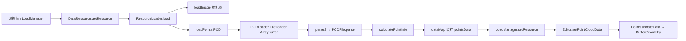

下面按「面试可讲的项目亮点」整理这套 PCD 点云加载链路，并说明 Web Worker 在项目里的真实角色（避免和代码不一致）。

---

## 一、整体架构（一句话）

**3D 点云标注工具的前端点云管线**：网络拉取 PCD → 二进制解析 → 结构化 TypedArray → 资源缓存/预加载 → Three.js BufferGeometry 渲染 →（可选）Worker 做点云上的重计算（AI 框选）。

---

## 二、端到端数据流



### 1. 资源调度层：`DataResource`

切帧时不会每次都重新下载，而是走 **预加载 + 内存缓存**：

| 能力 | 实现要点 |
|------|----------|
| 按需加载 | `ResourceLoader` 队列，一次只跑一个 loader |
| 邻近预取 | `loadMode: 'near_2'` 只加载当前帧 ±1；`'all'` 预加载全部 |
| 缓存上限 | `loadMax = 500`，防止多帧序列占满内存 |
| 进度 UI | `onProgress` → `LoadManager` 显示「加载点云 xx%」 |

核心加载代码：

```57:64:frontend/pc-tool/src/packages/pc-editor/common/DataResource.ts
        let pointsData = await this.dataResource.loadPoints(config.pointsUrl, this.handleProgress);

        let pointsInfo = this.dataResource.calculatePointInfo(pointsData);

        config.time = Date.now();
        config.pointsData = pointsData;
        config.ground = pointsInfo.ground;
        config.intensityRange = pointsInfo.intensityRange;
```

加载完成后会算 **地面高度 `ground`**（Z 轴直方图众数）和 **强度范围 `intensityRange`**，供着色器按强度着色。

### 2. 网络层：`PCDLoader.load`

基于 Three.js `FileLoader`，`responseType: 'arraybuffer'`，适合大文件、避免 UTF-8 解码整文件。

```86:98:frontend/pc-tool/src/packages/pc-render/loader/PCDLoader.ts
    load(url: string, onLoad: ICallBack, onProgress?: ICallBack, onError?: ICallBack) {
        const scope = this;

        const loader = new FileLoader(scope.manager);
        loader.setPath(scope.path);
        loader.setResponseType('arraybuffer');
        // ...
                    onLoad(scope.parse2(data));
```

### 3. 解析层：新旧两套实现

**当前生产路径：`parse2` → `PCDFile`（模块化）**

```430:463:frontend/pc-tool/src/packages/pc-render/loader/PCDLoader.ts
    parse2(data: any) {
        const pcdData = PCDFile.parse(data).pointsDataMap;
        // ...
          const _position = new Float32Array(pointN * 3);
          const _color = new Uint8Array(pointN * 3);
          // ...
          return {
            position: _position,
            color: hasColor ? _color : [],
            intensity:  targetI,
          }
      }
```

**`PCDFile.parse` 的优化点（面试可强调）：**

1. **Header 只读前 1KB** 判断 `DATA ascii/binary`，不必先把几十 MB 转成字符串  
2. **按字段列式存储**（`x[]/y[]/z[]/intensity[]`），比逐点 `{x,y,z}` 对象省内存、利于向量化  
3. **Binary 模式用 TypedArray 预分配**（`Float32Array` 等），按 `TYPE/SIZE` 用 `DataView` 读，避免大量临时数组  

```204:233:frontend/pc-tool/src/packages/pc-render/loader/PCDFile/lib.ts
export function getPointsFromDataView(
  dataview: DataView,
  header: IConfig,
  // ...
) {
  // ...
      dataMap[field] = dataMap[field] || new (typeArray(type, size))(header.points);
      dataMap[field][i] = item;
```

4. **NaN/Infinity 兜底**：`correctNumber` / `correctXYZ`，避免坏点把相机/包围盒算飞  

**遗留的 `parse()`**：仍支持 `ascii` / `binary` / **`binary_compressed`（LZF 解压）**，但 `load()` 已不走这条路径；新 `PCDFile` 明确只支持 ascii/binary。面试可以说：**做过格式兼容与解析重构，生产路径收敛到更高效实现**。

### 4. 渲染层：`Points` → Three.js

```19:34:frontend/pc-tool/src/packages/pc-render/points/Points.ts
function createGeometry(data: IData = { position: [], color: [], intensity: [] }) {
    let geometry = new THREE.BufferGeometry();
    let positionAttr = new THREE.Float32BufferAttribute(data.position || [], 3);
    let intensityAttr = new THREE.Float32BufferAttribute(data.intensity || [], 1);
    let colorAttr = new THREE.Uint8BufferAttribute(data.color || [], 3);
    geometry.setAttribute('position', positionAttr);
    geometry.setAttribute('intensity', intensityAttr);
    geometry.setAttribute('color', colorAttr);
```

自定义 `PointsMaterial` 在 GPU 上按 **高度 / 强度 / RGB / 过滤框** 着色，解析阶段只准备 attribute，渲染逻辑在 shader。

**竞态处理**：`loadUrl` 用 `timeStamp` 丢弃过期请求，快速切帧时不会用旧帧数据覆盖新帧。

---

## 三、Web Worker：实际在做什么？

**重要澄清：当前代码里 PCD 解析在主线程完成，并没有单独的 PCD Parse Worker。**

Worker 在 `TaskManager/create`，用于 **AI 辅助 3D 框标注**（`ObjectBox` + NumJs），处理的是 **已加载进 GPU/内存的点云**：

```23:31:frontend/pc-tool/src/packages/pc-editor/common/TaskManager/create/index.ts
    this.worker = new Worker(new URL('./worker.ts', import.meta.url), { type: 'module' });
    // ...
      this.worker.postMessage(data, transfer || []);
```

```121:134:frontend/pc-tool/src/packages/pc-editor/common/TaskManager/create/index.ts
    const float32Array = pc.array as Float32Array;
    const buffer = float32Array.buffer.slice(0);
    return this.postMessage(
      ITaskEnum.Create,
      { pc: buffer, projectPos, /* ... */ },
      [buffer],
    );
```

面试可以这样讲（准确且加分）：

> 点云加载解析目前在主线程，但加载后会通过 **Transferable ArrayBuffer** 把 `Float32Array` 零拷贝传给 Worker，在 Worker 里做点云聚类/路面提取/AI 最小包围盒等 **O(n) 级重计算**，避免拖拽标注时主线程卡顿。Worker 采用 **单任务队列**（`nextJob` + `working`），保证同一时刻只跑一个重任务。

若面试官问「为什么 PCD 不放 Worker」——可答：

- 下载 + 解析 + 写 BufferGeometry 目前串在主线程，大文件（百万点）可能卡 UI  
- **自然演进**：`FileLoader` 拿到 `ArrayBuffer` 后 `postMessage` 给 `pcd-worker.ts`，解析完再 `transfer` `Float32Array` 回主线程只负责 `updateData`——和现有 AI Worker 模式一致  

---

## 四、其它可讲的「工程亮点」

### 1. 多帧叠帧（`buildStackedResource`）

多帧 PCD 按 **位姿矩阵** 变换到当前帧坐标系再合并，带 `stackCache` 避免重复计算；位姿缺失（单位矩阵）会 fail-fast。

### 2. 资源与渲染解耦

- `DataResource`：下载、解析、元数据（ground/intensity）  
- `LoadManager`：切帧时绑定 view + 点云  
- `PointCloud` / `Points`：纯渲染  

便于单测解析、换加载策略而不动 Three 场景。

### 3. 内存意识

- 输出 `Float32Array` / `Uint8Array`，不是 `number[]`  
- 字段分列存储，合并叠帧时用 `set` 批量拷贝  
- 帧缓存有上限  

---

## 五、面试话术模板（STAR 简版）

**背景**：自动驾驶/点云标注场景，单帧 PCD 常 10MB+、百万点级，要在浏览器里流畅切帧、标注。

**任务**：设计前端点云加载与渲染管线，并保证 AI 框选等交互不卡。

**行动**：

1. 自研 `PCDLoader` + `PCDFile`，支持 PCD v0.7 ascii/binary，Header 增量解析、TypedArray 列存储  
2. `DataResource` 做邻近帧预加载、进度回调、ground/intensity 元数据  
3. Three.js `BufferGeometry` + 自定义 shader 做多模式着色  
4. Worker + Transferable 做点云侧 AI/几何重计算，与主线程渲染分离  

**结果**（按你真实数据填）：例如「邻近 3 帧预加载后切帧 &lt; X ms」「百万点 binary PCD 解析约 Y 秒」等。

---

## 六、若被追问的技术点

| 问题 | 参考回答 |
|------|----------|
| PCD 有哪些格式？ | ascii（文本行）、binary（定长 record）、binary_compressed（LZF，旧 `parse` 支持，现路径未用） |
| 为什么列式 `x/y/z`？ | 合并、变换、Worker 传 buffer 更方便；最后 `parse2` 再打成 `position` 的 `Float32Array` |
| rgb 怎么解析？ | packed float 或 3 字节，按字段 offset 读；`parse2` 里 `>> 16/8/0` 拆 R/G/B |
| intensity 归一化？ | 旧 `parse` 有 `mapLinear`；`parse2` 对 (0,1) 乘 255 |
| 主线程卡顿怎么优化？ | PCD Worker 解析；或 `requestIdleCallback` 分块；Downsample 后渲染 |
| Worker 通信？ | `postMessage` + `transfer` 列表，避免结构化克隆大数组 |

---

## 七、诚实建议

若简历/口述里写了「Web Worker 解析 PCD」，和当前仓库不一致。更稳妥的表述是：

- **「点云管线：主线程 PCD 解析 + Worker 做点云几何/AI 计算」**  
- 或补充：**「已将 PCD 解析 Worker 化作为优化项」**（若你打算做，我可以按现有 `PCDFile` 帮你拆一版 `pcd.worker.ts` 设计）

需要的话我可以再写一版 **30 秒 / 2 分钟** 口述稿，或按「把 PCD 解析迁到 Worker」给出具体改造步骤和接口设计。
