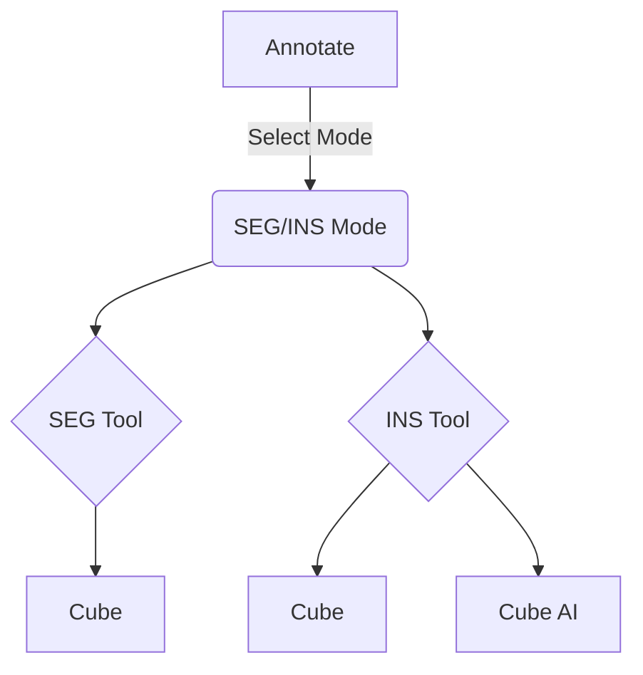

# 4DAPF-Segmentation

# 语义分割功能设计(Semantic Segmentation Function Design)

## Image Annotation Tool

### 完整流程

#### 数据结构定义

**暂定**: 与实例检测(**Instance**)相同, 标注工具采用多边形(**Mask Polygon**), 使用**annotationType**来区别是实例检测还是语义分割; 如有需要, 后续可能会扩展标注功能和数据格式(因为其余平台导出数据为像素点一类数组, 本质上只需要改变一个标注结果的图形数据即可, 例如**points**数组现在存储顶点坐标, 改为存储像素点);

#### 标注模式(Mode)切换

切换标注模式时需要清空部分编辑状态, 切换标注(绘制)工具列表&结果列表, 并且禁用追踪复制功能等;

#### 编辑类别(Class)

**Instance**的编辑类别是按照工具类型进行了过滤的, **Segmentation**的编辑类别规则不同, 只要是语义分割的结果, 不管使用什么工具绘制的, 都可进行编辑;

#### 保存和获取

保存时多传入**annotationType**字段来区别是**Instance**还是**Segmentation**; 

获取时也根据此字段(和其余附加条件)来区别加入哪个图形根节点(**root\_ins/root\_seg**)

#### 数据导出/导入

导出需要服务端支持, 目前导出的**annotationType**只为**INSTANCE**; 

导入时需要将JSON文件里的**annotationType**字段同步到数据库; **服务端已完成**

### 后续更新

**注**: 目前只是工具支持语义分割标注的流程打通, 具体数据格式(标注/导入/导出)都需要根据具体需求再进行更新, 举例: 部分工具标注分割时使用笔刷等工具, 标注结果为像素点数据和一个图片文件; 而我们目前仅仅是Polygon的顶点;

## PointCloud Annotation Tool

### 流程

点云分割主流程和图片分割类似, 可以先做主流程打通, 具体标绘工具和数据格式可根据需求再行更新;

工具: RECT/POLOGON (常见)

*   数据格式目前只区分**annotationType**, 数据格式按实例检测格式来, 后续具体需求具体更改;
    
    ### 切换到语义分割模式
    
    #### 列表：
    
    1.  绘制/模型工具切换, 列表切换 --- √
        
        1.  result list filter 
            
    2.  禁用追踪复制功能 --- √
        
    3.  非语义分割结果不可编辑 --- √
        
        1.  UI控制,快捷键控制
            
    4.  清空一系列状态: 当前类别等 --- √
        
        1.  编辑状态不可切换
            
        2.  清空当前类别
            
    5.  关闭类别编辑窗口 --- √
        
    6.  禁用三视图 --- todo
        
    7.  取消当前选中 --- √
        
    8.  保存/获取时应用**annotationType**字段 --- √
        
    9.  分割类型定义对应工具 --- √
        
    10.  ...
        
    
    #### 重构点：
    
    1.  工具列表, 区分语义分割工具和实例检测工具 --- √
        
    2.  标注结果区分 --- √
        
        1.  顶级节点区分/按类型区分 
            
    3.  绘制时定义类型 --- √
        
    4.  ...
        

### Graph

# 分割概念

## QA: 图像分割要哪些数据？

图像分割（Image Segmentation）通常需要比简单地围起来的几个点坐标**多得多**的数据。

图像分割的目标是将图像中的**每一个像素**都归类到某个特定的对象类别或区域（比如人、车、天空、道路等）。最终的输出是一个与原图大小相同的**分割掩码（Segmentation Mask）**，其中每个像素的值代表它所属的类别或对象实例。

因此，训练图像分割模型所需的标准数据是**像素级别的标注数据（Pixel-level Annotation / Ground Truth Masks）**。这意味着对于每一张用于训练的图像，您都需要提供一个对应的掩码图像，在这个掩码图像中：

1.  想要分割的每一个对象的**每一个像素**都必须被精确地标记出来。
    
2.  不同的对象实例（如果是做实例分割）或不同的类别（如果是做语义分割）需要用不同的值或颜色来区分。
    
3.  背景像素也需要有一个特定的标记。
    

**如何创建这种像素级别的标注数据？**

常用的方法包括：

1.  **多边形标注（Polygon Annotation）**：沿着对象的轮廓精确地绘制多边形。标注工具会根据这个多边形生成内部像素的掩码。这是最常见的方式之一。
    
2.  **刷子工具/像素画笔（Brush/Pixel Brush）**：使用画笔工具直接在像素层面上涂抹，标记属于某个类别的像素。这种方法更适合不规则形状的对象或区域，但也更耗时。
    
3.  **智能工具辅助**：一些标注工具提供智能辅助功能，比如基于边缘检测或前一帧标注结果的辅助，以提高标注效率。
    

**为什么几个点不够？**

围起来的几个点坐标（通常称为关键点或点集标注）**不足以**精确地描述一个对象的完整边界和内部像素范围。这些点只能给出对象的大致位置或轮廓的几个重要拐点，无法覆盖所有像素信息。

**例外情况：**

*   **交互式分割（Interactive Segmentation）**：在某些应用场景或特定的模型（如 SAM - Segment Anything Model）中，可以在**推理（Inference）阶段**提供一些简单的提示（比如对象内部的几个点、对象上的一个点、一个框或一个简单的涂鸦）来引导模型生成分割掩码。但这依赖于模型已经通过大量的**完整像素级标注**数据进行了预训练。提供的点只是作为**输入提示**，而不是用于从头训练模型。
    

**总结：**

对于训练一个通用的、高性能的图像分割模型，需要大量的**高精度像素级分割掩码**作为训练数据，而不仅仅是几个点坐标。每个对象的完整轮廓和其包含的所有像素都需要被准确地标注。
