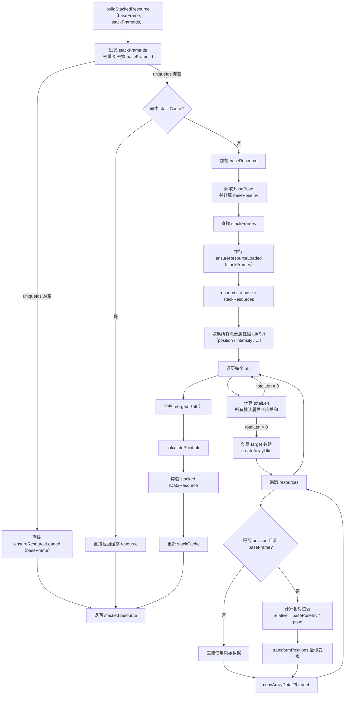

# 4DAPF-叠帧

### 需求

> 例：一份连续帧数据50帧，在标注某一帧的静态障碍物时，由于点云稀疏，需要将其余帧的点云数据叠加到在标帧来辅助标注。

### 方案

#### 1.交互

提供入口选择将指定范围帧（不包括当前帧）叠加到当前帧。

#### 2.明细

1.  现有local\_pose.json数据，构造对应帧的local\_pose写入帧数据中
    
2.  计算点云相对坐标叠加到目标帧
    
    1.  读取需要叠加的帧
        
    2.  将数据加载到目标帧
        
        1.  对每个坐标应用世界矩阵变换到世界坐标
            
        2.  再应用目标帧的世界矩阵的逆变换到目标坐标系
            
    3.  加载完成
        
3.  重复叠帧？是否可以多次执行叠帧操作，例：第一次叠了2-10，觉不够，再次叠10-20
    
4.  解除叠帧（时机？：提供解除按钮 / 切换帧自动解除）
    

由local\_pose.json得到 **4×4 齐次变换矩阵** $T\_i$，表示车辆坐标（ego）相对于世界坐标（或局部参考）的位置与姿态

对于第i帧点云中的任意一点$P\_i$

1.  变换到全局坐标 $P\_{world}$ = $T\_i \cdot P\_i$
    
2.  全局坐标到目标帧坐标(假设第0帧) $P\_0 = T\_0^{-1} \cdot P\_{world}$
    
3.  合并
    

反之将某一帧的静态障碍物标注结果分回每一帧也是这个转换逻辑（二阶段）

#### 3.问题

*   local\_pose.json文件里的每个时间戳的local\_pose如何和50帧的每一帧对应（算法取最近的时间戳的local\_pose？）
    

```json
{
    "pose": {
        "1756090350690": {
            "timestamp_ms": 1756090350690,
            "trans_xyz_m": [
                4424.693273720394,
                5145.762664117412,
                39.44526472625877
            ],
            "quat_xyzw": [
                -0.0021291142754636273,
                6.148378412298661e-05,
                -0.4354578977834304,
                0.90020657759771
            ],
            "vel_xyz_ms": [
                0.9038,
                -1.1135,
                -0.0208
            ]
        },
    }
}
```

#### 4.总结

需注意：

*   点云坐标是否在 ego 坐标系；
    
*   叠帧的解除与缓存管理；
    
*   精度与性能细节。
    
*   **性能优化**   
    前端点云叠加可在 GPU 上完成（WebGL / THREE.js BufferGeometry + Matrix4.applyMatrix4）。
    

*   **精度保证**  
    建议 `quat_xyzw` → 旋转矩阵转换时，保持双精度（Float64Array），否则累计误差可能影响毫米级标定。
    

*   **存储策略**  
    如果叠帧结果较大，可只保留体素下采样后的点云（VoxelGrid 或 Octree），以降低内存。
    

#### 5.优化点

点云坐标转换

##### CPU版本

1.  读取目标帧和当前帧的位姿矩阵 $T\_0, T\_i$
    
2.  对当前帧的点云数组执行坐标变换：
    
    ```javascript
    // 伪代码
    const T0Inv = new THREE.Matrix4().copy(T0).invert();
    
    for (let i = 0; i < points.length; i += 3) {
      const p = new THREE.Vector3(points[i], points[i + 1], points[i + 2]);
      p.applyMatrix4(Ti);      // 转到世界坐标
      p.applyMatrix4(T0Inv);   // 再转到目标帧坐标
      points[i] = p.x;
      points[i + 1] = p.y;
      points[i + 2] = p.z;
    }
    ```
    
3.  将变换后的点数据写入geometry（渲染引擎的数据结构）中渲染
    

##### GPU版本（WebGL GLSL实现）

让叠帧变换在GPU上执行，需要将变换矩阵传入顶点着色器（Vertex Shader），让GPU在渲染时实时执行坐标变换。

1.  为每帧点云定义一个变换矩阵 Uniform（glsl内置变量）:
    

```javascript
material.uniforms.T_i = { value: Ti };
material.uniforms.T0_inv = { value: T0Inv };
```

2.  在顶点着色器中进行矩阵变换：
    
    ```javascript
    // 顶点着色器 vertex.glsl
    uniform mat4 T_i;
    uniform mat4 T0_inv;
    attribute vec3 position;
    
    void main() {
        vec4 p_world = T_i * vec4(position, 1.0);
        vec4 p_target = T0_inv * p_world;
        gl_Position = projectionMatrix * modelViewMatrix * p_target;
    }
    
    ```
    
3.  **渲染时，GPU 对每个点执行上述矩阵乘法（A/N卡通用）**
    

### 实现时问题

1.  帧变换矩阵只能存储在每一帧里，所以只能帧加载后才操作叠帧
    

### 实际实现 Todo

*   放在 DataResource 是因为它本就统一管理点云加载、缓存及 ground/intensity 计算，叠帧仅需在原有点数据上做变换与合并，不会侵入业务层逻辑。
    
*   onApplyStack() #Apply Stack Frames
    
*   onCancelStack() #Cancel Stack Frames
    


