# 4DAPF-点云投影到图像

## 标定文件说明

送标数据的sensor2ego(4x4矩阵)是cam坐标系->ego坐标系，在设置为相机外参时取逆。

原始lidar2cam(4x4矩阵)是ego坐标系->cam坐标系。

## 应用畸变系数并投影

> 以一个3d\_box标注结果为例

#### 流程图

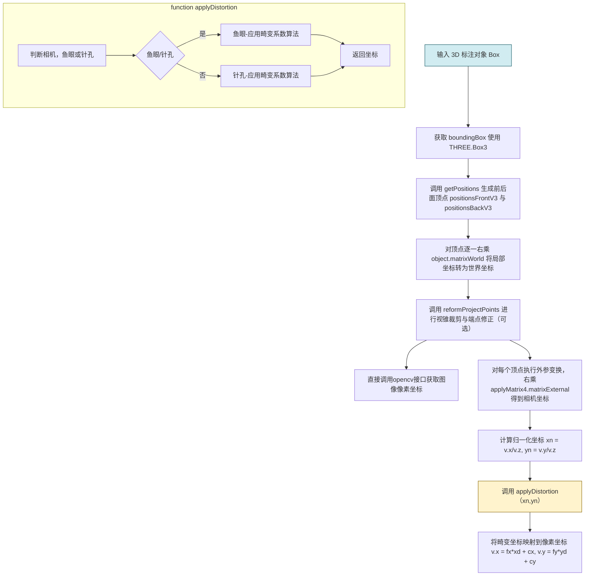

#### 问题示例

例：人在索引为2的相机里没有投影上，其余标注框也是，靠近鱼眼相机边缘时投影不到。

示例数据地址：NULL 数据集：V1.3-4 / PC352\_20250825\_105118\_clip0000 / 第一帧

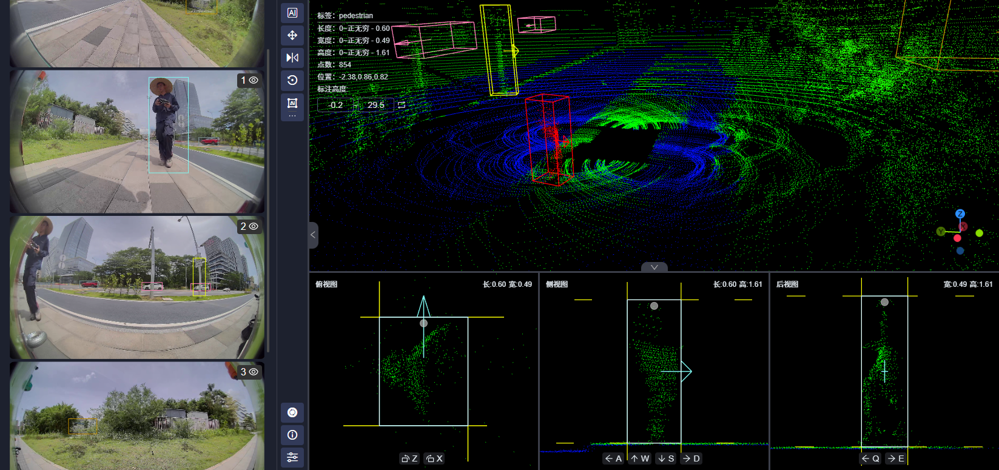

> 注：此问题已解决，原因是在投影前做了过滤，判断点是否在图像内，这个函数更新为判断畸变后的点是否在图像内。

#### 源代码

> 此代码比较可控。

```javascript
{
    // 右乘世界矩阵将局部坐标转换为世界坐标
    positionsFrontV3.forEach((v) => {
        v.applyMatrix4(matrix);
    });
    // 投影并应用畸变参数
    positionsFrontV3.forEach((v) => {
        v.applyMatrix4(this.matrixExternal); //将每个顶点（世界坐标）右乘相机外参转变为相机坐标
        const xn = v.x / v.z; //归一化坐标
        const yn = v.y / v.z; //归一化坐标
        const [xd, yd] = this.applyDistortion(xn, yn); //应用畸变参数
        v.x = this.cameraInternal.fx * xd + this.cameraInternal.cx; //应用内参得到像素坐标
        v.y = this.cameraInternal.fy * yd + this.cameraInternal.cy; //应用内参得到像素坐标
    });
}
/**
 * 示例，只保留了核心部分代码
 * 应用畸变参数
 * @param xn 
 * @param yn 
 * @returns 返回应用畸变参数后的坐标
 */
applyDistortion(xn: number, yn: number): [number, number] {
    const d = this.distortion || [];

    // 判断畸变参数格式
    let isFisheye = false;
    let distortionParams: any = {};

    const r2 = xn * xn + yn * yn;
    const r = Math.sqrt(r2);

    if (isFisheye) {
        // Kannala–Brandt 鱼眼模型：k1, k2, k3, k4
        const { k1, k2, k3, k4 } = distortionParams;

        if (r < 1e-8) return [0, 0]; // 近似原点，直接返回避免数值不稳定

        const theta = Math.atan(r);
        const theta2 = theta * theta;
        const theta3 = theta2 * theta;
        const theta5 = theta3 * theta2;
        const theta7 = theta5 * theta2;
        const theta9 = theta7 * theta2;

        const theta_d = theta + k1 * theta3 + k2 * theta5 + k3 * theta7 + k4 * theta9;
        const scale = theta_d / r;

        return [xn * scale, yn * scale];
    } else {
        // 针孔模型（OpenCV rational model）
        const { k1, k2, p1, p2, k3, k4, k5, k6 } = distortionParams;

        const r4 = r2 * r2;
        const r6 = r4 * r2;

        const num = 1 + k1 * r2 + k2 * r4 + k3 * r6;
        const denom = 1 + k4 * r2 + k5 * r4 + k6 * r6;
        const radial = denom !== 0 ? num / denom : num;

        const xTangential = 2 * p1 * xn * yn + p2 * (r2 + 2 * xn * xn);
        const yTangential = p1 * (r2 + 2 * yn * yn) + 2 * p2 * xn * yn;

        const xDistorted = xn * radial + xTangential;
        const yDistorted = yn * radial + yTangential;

        return [xDistorted, yDistorted];
    }
}
```

## 使用opencv.js投影

> 问题：接口文档阅读困难。

> opencv.js是构建后的文件，不能修改，如要修改只能拉取[https://github.com/opencv/opencv.git](https://github.com/opencv/opencv.git)\->修改源码，然后通过Emscripten重新构建opencv.js。

```javascript
    /** 应用畸变系数（调opencv.js接口） */
    positionsFrontV3.forEach((v) => {
        const res = this.applyDistortionByOpenCV(v)
        v.x = res.u
        v.y = res.v
    });
    /** 此处与提供的Python代码逻辑一致  */
    applyDistortionByOpenCV(v: THREE.Vector3) {
        if (this.camera_model === "pinhole") {
            // LiDAR坐标 → 相机坐标
            const vc = v.clone().applyMatrix4(this.matrixExternal);
            if (vc.z <= 0) return { u: vc.x, v: vc.y, depth: vc.z }; // 在相机后方的点忽略
        
            // 构造 OpenCV 输入数据
            const objectPoints = cv.matFromArray(1, 3, cv.CV_32F, [vc.x, vc.y, vc.z]);
        
            const rvec = cv.Mat.zeros(3, 1, cv.CV_32F); // 已在相机坐标系，无旋转
            const tvec = cv.Mat.zeros(3, 1, cv.CV_32F); // 已在相机坐标系，无平移
        
            const cameraMatrix = cv.matFromArray(3, 3, cv.CV_32F, this.intrinsic_matrix.flat());
            const distCoeffs = cv.matFromArray(1, 8, cv.CV_32F, [
                this.distortion.k1, this.distortion.k2,
                this.distortion.p1, this.distortion.p2,
                this.distortion.k3, this.distortion.k4,
                this.distortion.k5, this.distortion.k6
            ]);
        
            const imagePoints = new cv.Mat();

            // 调用 OpenCV.js 接口
            cv.projectPoints(objectPoints, rvec, tvec, cameraMatrix, distCoeffs, imagePoints);
            
            // 提取像素坐标
            const u = imagePoints.data32F[0];
            const v_img = imagePoints.data32F[1];
              
            return { u, v: v_img, depth: vc.z };
          
        } else if (this.camera_model === "fisheye") {
            // LiDAR坐标 → 相机坐标
            const vc = v.clone().applyMatrix4(this.matrixExternal);
            if (vc.z <= 0) return { u: vc.x, v: vc.y, depth: vc.z }; 
        
            // 构造 OpenCV 输入数据
            // 构造 3D 点: 1x1, 3 通道, CV_32F
            const objectPoints = cv.matFromArray(1, 1, cv.CV_32FC3, [vc.x, vc.y, vc.z]);
            
            // 旋转和平移向量: 3x1, CV_32F (零矩阵表示点已在相机坐标系)
            const rvec = cv.Mat.zeros(3, 1, cv.CV_32F); 
            const tvec = cv.Mat.zeros(3, 1, cv.CV_32F); 
            
            // 相机内参 K: 3x3, CV_32F
            const cameraMatrix = cv.matFromArray(3, 3, cv.CV_32F, this.intrinsic_matrix.flat());

            // 畸变系数 D: 4x1, CV_32F
            const distCoeffs = cv.matFromArray(4, 1, cv.CV_32F, [
                this.distortion.k1, 
                this.distortion.k2,
                this.distortion.k3, 
                this.distortion.k4
            ]);
        
            const imagePoints = new cv.Mat();
            // 调用 OpenCV.js 接口
            cv.fisheye_projectPoints(objectPoints, imagePoints, rvec, tvec, cameraMatrix, distCoeffs);
                
            // 提取像素坐标
            // imagePoints 应该是 N x 1, 2 通道或类似结构
            const u = imagePoints.data32F[0];
            const v_img = imagePoints.data32F[1];
                
            return { u, v: v_img, depth: vc.z };
          
        } else {
            return { u: v.x, v: v.y, depth: v.z };
        }
    }
        
```

#### 针孔相机

针孔相机图像靠近边缘时有轻微变化，但是图像中心处几乎没有变化

使用opencv.js库（前/后）

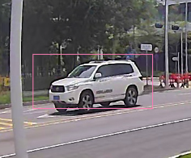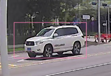

#### 鱼眼相机

几乎没有区别

使用opencv.js库（前/后）：

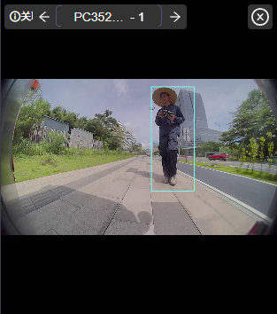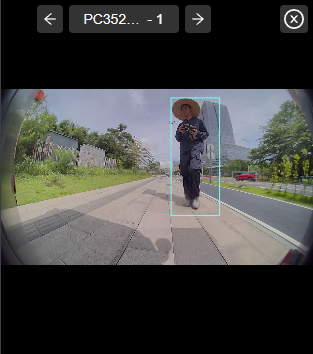

计算结果数值接近：

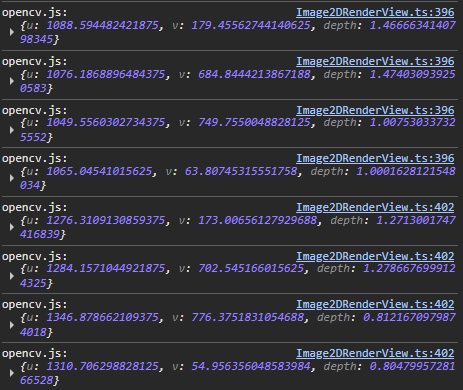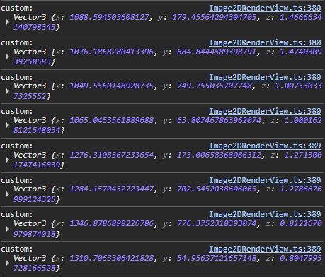

## 原始流程

这是xtreme1原始代码，未考虑畸变

```javascript
    /** 原代码直接投影（使用threejs相机矩阵，未考虑畸变） */
    positionsFrontV3.forEach((v) => {
        // 世界坐标->相机坐标
        v.applyMatrix4(this.camera.matrixWorldInverse); // 此处matrixWorldInerse是设置相机参数后自动生成的，理论上不如直接使用相机外参精准
        // 相机坐标->标准化设备坐标(NDC)
        v.applyMatrix4(this.camera.projectionMatrix);
        // NDC->图像像素坐标
        this.projectToImg(v);
    });
    /**
     * 归一化设备坐标 -> 像素坐标
     * @param pos 
     * @param target 
     * @returns 
     */
    projectToImg(pos: THREE.Vector3, target?: THREE.Vector3) {
        target = target || pos;
        pos.x = ((pos.x + 1) / 2) * this.imgSize.x;
        pos.y = (-(pos.y - 1) / 2) * this.imgSize.y;

        return target;
    }
```

## 问题列表

#### 鱼眼相机投影 

图像在鱼眼相机边缘时投影的问题，opencv投影算法会出现这样的情况，原因是标注框在相机边缘时的部分顶点已经不在相机范围内，使用opencv的投影函数会将顶点投影到异常的位置，这个时候包围框会由于异常点的存在变得异常。

**解决方案**是在代码里做限制，将顶点从世界坐标转换为相机坐标时z值小于0的点视为无效点，不作为计算投影后Box包围框的有效点。

结论：投影算法与流程没有问题，加上对异常点的处理即可。

常见投影情况示例：

1.正常情况 （有效点 = 8）

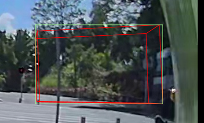

2.有效点个数 > 4

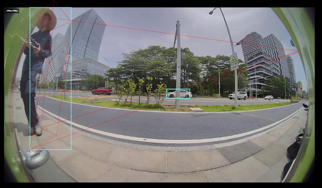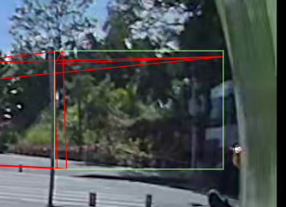

3.有效点个数 = 4

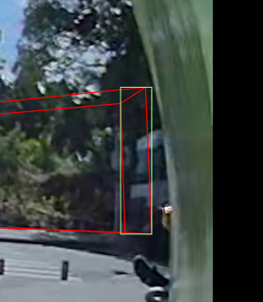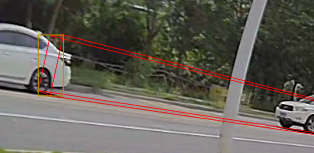

4.1 <有效点个数 < 4

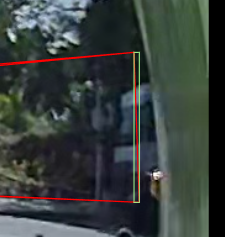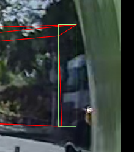

5.有效点个数 = 1

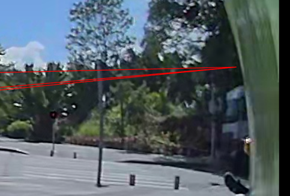

#### 优化措施

简单做法: 有效点个数<8 时 (即不能完整投影时), 将图像左侧的投影结果固定 minX=0, 将图像右侧的投影结果固定 maxX = 图像宽度(1920)

可与上方相同帧的投影结果做对比

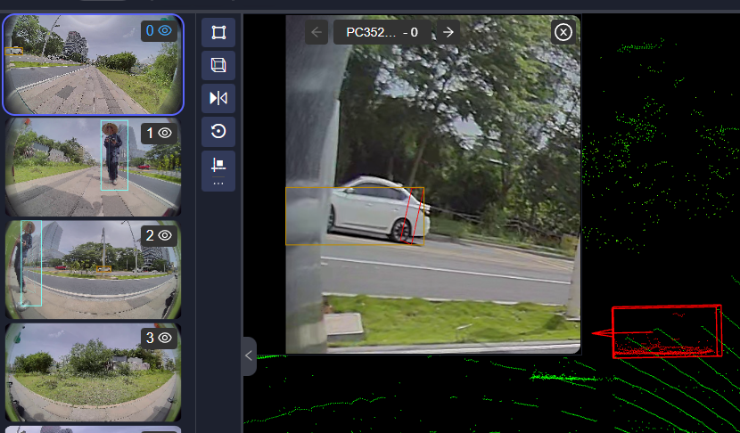    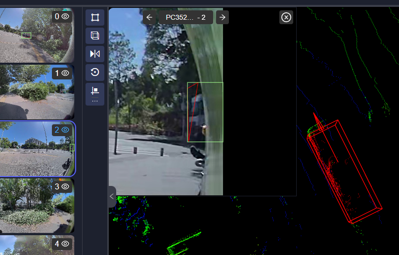

完整做法(待完善): 计算相机可视域与立体框交点作为有效点投影.
